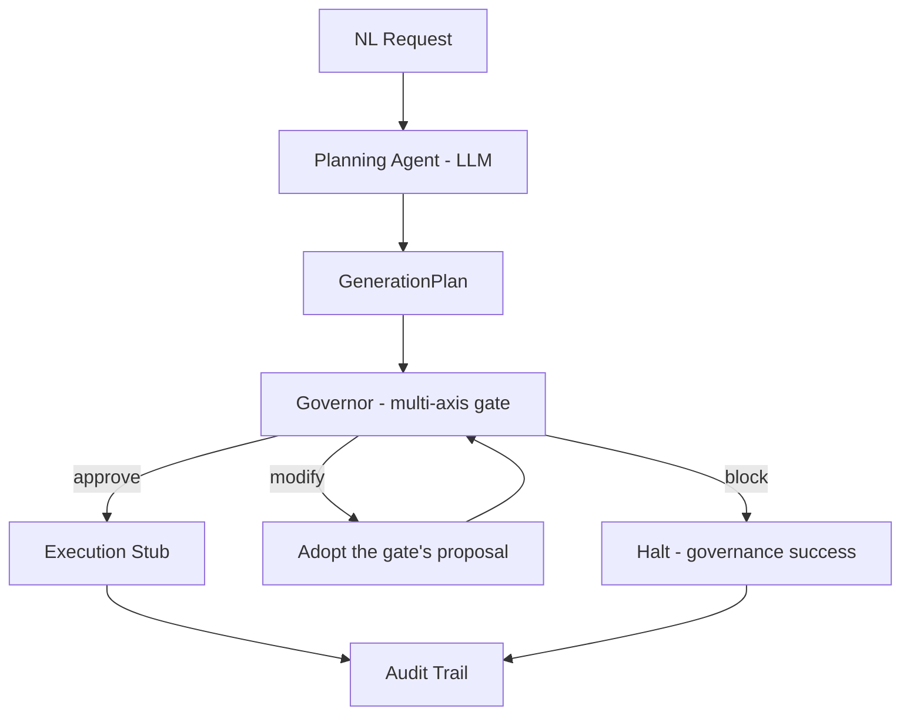

# FinOps Governor for Synthetic Data Pipelines

## What this is

A **pre-flight gate for training-value-per-GPU-dollar** in synthetic-data generation.
Before a single frame renders, it refuses jobs that are **over budget**, **geometrically
invalid**, or **predictably low training-value** - and tells you, in dollars, how much of
a job's spend would be wasted.

> _"scene 'floor': 50,000 variations across ~16 declared configurations (~3,125x
> oversampled, ~100% redundant); est. $373.18 of spend adds little training value."_

The three checks are one idea: each is a reason **not to spend GPU-hours on this job,
catchable before you spend**. An LLM proposes plans; a deterministic gate decides. The
headline axis - diversity/redundancy gating - catches the expensive failure no standard
tool catches pre-execution: spending on data that is affordable and renderable but teaches
the model almost nothing.

## Try it

```bash
# English in, governed job out: the LLM plans, the deterministic gate decides,
# waste is trimmed and adopted automatically, and the audit trail is the receipt
# (needs ANTHROPIC_API_KEY)
python -m finops_governor "50,000 variations of a robotic arm on an assembly \
floor, RGB and depth" --budget 1000 --audit audit.json

# a $373 job that is ~100% redundant -> flagged in dollars AND handed back
# as a 26-variation, $0.20 proposal at the same expected-coverage bar (exit 1)
python -m finops_governor fixtures/diversity/redundant/production_scale.json

# a job that is affordable and diverse but geometrically broken -> BLOCKED, $0 spent
python -m finops_governor fixtures/geometry/floor_clip_scene.json --geometry
```

Exit codes compose into pipelines: evaluate mode mirrors the verdict (0 = APPROVE,
1 = MODIFY, 2 = BLOCK); plan mode mirrors the terminal state (0 = EXECUTED,
2 = BLOCKED, 3 = FAILED) - MODIFY never terminates the pipeline, it is adopted.

## How it works



Every step appends an audit event; the trail records which axis drove each decision and
what adoption saved - the audit log of a governed job is the dollars-saved receipt.

The **planner** turns natural language into a `GenerationPlan`, forced through a strict
schema with a bounded repair loop - the LLM's output is untrusted until validated, and
the caller's budget is enforced by code, not by prompt. The **Governor** then runs
independent validity checks - cost, diversity, and USD geometry - aggregates their
findings, and composes one approve / modify / block decision. Checks reason over the
plan and scene description, never over generated data, which preserves the "block before
GPU spend" guarantee. A generated plan gets no special treatment: the gate judges the
planner's output like anyone else's.

When a plan is recoverable, the proposal is built in two ordered passes (ADR 0007):
**value first** - scenes are trimmed to their expected-coverage-justified variation
counts, removing only predictably redundant frames - then **budget** only if the plan
still exceeds its ceiling. Never cut signal while waste remains.

The **orchestrator** (M7) runs the whole loop as pure node functions over one typed,
immutable state - plain Python, deliberately LangGraph-isomorphic (ADR 0008: the
framework is deferred with a named threshold). MODIFY is adopted deterministically -
the gate already built the cheaper, coverage-preserving plan, so no LLM round-trip is
spent rediscovering it - and convergence in exactly one extra gate pass is a verified,
bounded invariant.

| Axis | Question | Catches |
|---|---|---|
| Cost (M2/M3) | Can we afford this? | Over-budget jobs; proposes a trimmed variant when recoverable |
| Diversity (M4/M6.5) | Is it worth it? | Predictably redundant spend - quantified in dollars and trimmed away (expected-coverage model, cost-per-distinct metric) |
| Geometry (M5) | Is the scene even valid? | Missing assets, assets through the floor, cameras aimed at nothing |

## Scope

**In scope:** NL -> structured plan; pre-execution cost estimate; deterministic gate that
composes budget, diversity, and geometric-validity axes; execution stub; audit trail.

**Out of scope:** running large-scale generation (execution is stubbed - the *governance*
is the product); GPU autoscaling; downstream model training; validating rendered output
images.

## Status

- **M1** (`v0.1-schema`): the `GenerationPlan` contract + randomization block.
- **M2** (`v0.2-deterministic-gate`): deterministic cost estimator + budget gate.
- **M3** (`v0.3-validity-gate`): the multi-axis Governor - checks composed into one decision.
- **M4** (`v0.4-diversity-gate`): **the diversity/redundancy gate** - a pre-execution
  estimate of wasted, low-training-value spend, quantified in dollars.
- **M5** (`v0.5-usd-validity`): the OpenUSD geometric-validity gate - real stages,
  validated pre-render (existence, penetration, framing).
- **M6** (`v0.6-planner`): the planning agent - NL to schema-valid plans behind a model
  seam, with a bounded repair loop and code-enforced budget authority.
- **M6.5** (`v0.6.5-value-gate`): **the gate acts on the waste it prices** - expected-
  coverage diversity model (coupon-collector), cost-per-distinct metric, value-aware
  modification (ADR 0007), adversarial prompt-injection suite, mypy in CI.
- **M7** (`v0.7-orchestration`): the pipeline - node-functions-over-typed-state
  orchestrator (plain Python, ADR 0008), adopt-on-modify with a verified convergence
  bound, and the structured audit trail with per-decision axis attribution.
- **Next: M8 - service, packaging, demo** (`v1.0`).

See [ROADMAP.md](./ROADMAP.md) for the full plan, [docs/](./docs/) for design specs, and
[docs/adr/](./docs/adr/) for architecture decisions.

## Quickstart

```bash
python3.12 -m venv .venv && source .venv/bin/activate
pip install -e ".[dev]"
pytest
```
