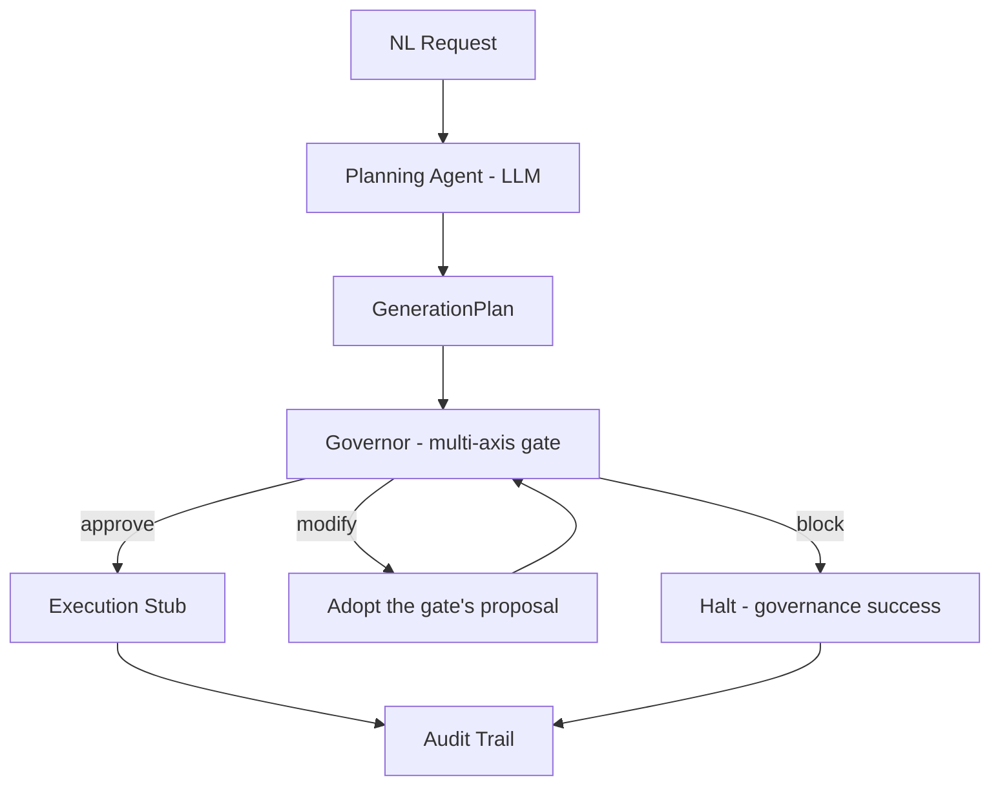

# FinOps Governor for Physical-AI Synthetic Data Pipelines

**A pre-flight gate for training-value-per-GPU-dollar in Physical AI.** Before a single frame renders,
it refuses synthetic-data jobs that are **over budget**, **geometrically invalid**, or
**predictably low training-value** - prices the waste in dollars, and hands back the
plan without it.


> _"50000 variations over ~16 declared configurations - expected ~100% redundant; est.
> **$373.18** of spend adds little training value (effective **$23.33/distinct
> configuration** vs $0.0037/image nominal); recoverable by trimming to 26 variations."_
>
> _"proposal: fits budget at **$0.20**"_

The three checks are one idea: each is a reason **not to spend GPU-hours, catchable
before you spend**. An LLM proposes plans; a deterministic gate decides - and when a
plan is recoverable, the gate builds the cheaper, coverage-preserving version itself.

| Axis | Question | Catches |
|---|---|---|
| Cost | Can we afford this? | Over-budget jobs; proposes a trimmed variant when recoverable |
| Diversity | Is it worth it? | Predictably redundant spend - expected-coverage model, priced in dollars, trimmed away |
| Geometry | Is the scene even valid? | Missing assets, assets through the floor, cameras aimed at nothing - on real OpenUSD stages |

## Install

```bash
git clone https://github.com/hamzaaaljundi/finops-governor && cd finops-governor
python3.12 -m venv .venv && source .venv/bin/activate
pip install -e .
```

Also published to [TestPyPI](https://test.pypi.org/project/finops-governor/) as
packaged evidence:

```bash
pip install --index-url https://test.pypi.org/simple/ \
    --extra-index-url https://pypi.org/simple/ finops-governor
```

## Try it

```bash
# the headline: a $373 job that is ~100% redundant -> priced AND trimmed (exit 1)
finops-governor fixtures/diversity/redundant/production_scale.json

# affordable and diverse, but the arm is authored through the floor -> BLOCKED, $0 spent
finops-governor fixtures/geometry/floor_clip_scene.json --geometry

# which GPU should this job run on? (the mid-tier card wins, not the cheapest-per-hour)
finops-governor fixtures/plans/valid/multi_scene.json --advise
```

### The full pipeline: English in, governed job out (needs `ANTHROPIC_API_KEY`)

```bash
finops-governor "50,000 variations of a robotic arm on an assembly floor, \
RGB and depth" --budget 1000 --audit audit.json
```

A real session:

```text
pipeline:  "50,000 variations of a robotic arm on an assembly floor, RGB and depth"  (budget $1,000.00, NVIDIA A10G (AWS g5.xlarge))
  1. plan     planned 'robotic-arm-assembly-floor-001' (assembly-floor-robotic-arm x50000)
  2. gate     verdict APPROVE on 'robotic-arm-assembly-floor-001': Estimated $14.79 is within the $1000.00 budget.
  3. execute  execution stub: would render 150,000 images (14.70 GPU-hours, $14.79) on NVIDIA A10G (AWS g5.xlarge)
status:    EXECUTED
final:     $14.79 of $1,000.00 budget
audit:     audit.json
```

When the gate finds waste, the trail also shows the trim: a MODIFY verdict, an `adopt`
event with the savings, a re-gate, and execution of the trimmed plan - the audit log of
a governed job is the dollars-saved receipt.

Exit codes compose into pipelines: evaluate mode mirrors the verdict (0 = APPROVE,
1 = MODIFY, 2 = BLOCK); pipeline mode mirrors the terminal state (0 = EXECUTED,
2 = BLOCKED, 3 = FAILED) - MODIFY never terminates the pipeline, it is adopted.

## The HTTP service

```bash
uvicorn finops_governor.service:app
# interactive docs at http://127.0.0.1:8000/docs
```

`POST /evaluate` (one gate pass), `POST /pipeline` (the full run; the response is the
audit trail), `POST /advise`, `GET /profiles`, `GET /health`. HTTP codes describe the
transaction, never the verdict: a BLOCK is the gate working (200); clients branch on
`verdict` / `status` in the body. Design: [docs/service-model.md](./docs/service-model.md).

## How it works



The **planner** turns natural language into a `GenerationPlan`, forced through a strict
schema with a bounded repair loop - the LLM's output is untrusted until validated, and
the caller's budget is enforced by code, not by prompt. The **Governor** runs
independent validity checks over the plan and scene description (never over generated
data, preserving the block-before-GPU-spend guarantee) and composes one decision. A
generated plan gets no special treatment: the gate judges - and trims - the planner's
own output.

Recoverable plans get a proposal built in two ordered passes (ADR 0007): **value
first** - scenes trimmed to their expected-coverage-justified variation counts - then
**budget** only if still needed. Never cut signal while waste remains. The
**orchestrator** runs the loop as pure node functions over one typed, immutable state -
plain Python, deliberately LangGraph-isomorphic (ADR 0008 defers the framework with a
named threshold) - and MODIFY converges in exactly one extra gate pass, a verified,
bounded invariant.

## Scope

**In scope:** NL -> structured plan; pre-execution cost estimate; a deterministic gate
composing budget, diversity, and geometric-validity axes; hardware advisor; execution
stub; audit trail; CLI + HTTP service.

**Out of scope:** running large-scale generation (execution is stubbed - the
*governance* is the product); GPU autoscaling; downstream model training; validating
rendered output images. Render-time constants are conservative engineering estimates;
calibrating against a measured Isaac Sim run on the reference GPU is the named next
step ([docs/cost-model.md](./docs/cost-model.md), section 5).

## The build

Eight releases, each consuming the previous milestone's guarantees - schema, cost gate,
multi-axis governor, diversity gate, OpenUSD validity, planner, value-aware
modification, orchestration, service. 291 tests, ruff + mypy strict, CI across Python
3.11-3.13. Design specs in [docs/](./docs/), decision records in
[docs/adr/](./docs/adr/), the full arc in [ROADMAP.md](./ROADMAP.md).

```bash
pip install -e ".[dev]"
ruff check . && ruff format --check . && mypy src && pytest -q
```
