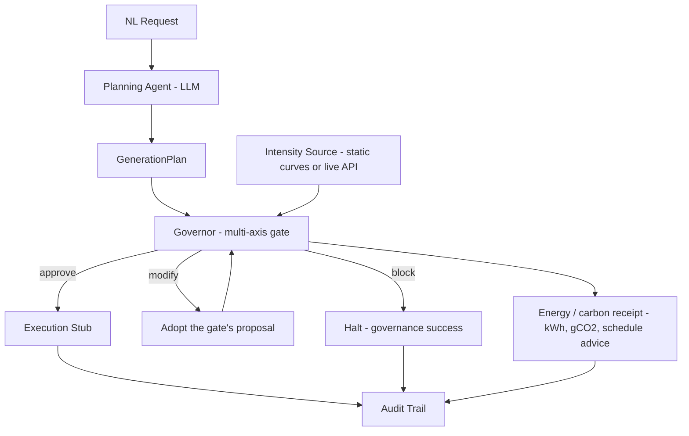

# FinOps Governor for Physical AI Synthetic Data Pipelines


**A deterministic pre-flight gate for synthetic-data GPU spend.** Before a single frame
renders, it refuses jobs that are **over budget**, **geometrically invalid**, or
**predictably redundant against their own declared randomization** - prices the waste in
dollars, and hands back the plan without it. Since v2, it also reports what a job
**burns**: every trim carries a carbon receipt.

The diversity axis measures **declared-parameter redundancy** (how much of a job's
declared randomization space gets resampled given its variation count) - a real,
computable proxy for wasted spend, and a defensible pre-execution signal. It is **not**
a validated measure of downstream training value: no claim is made here, or anywhere in
this repo, that low redundancy in declared parameter space causes a better-trained
policy. That link is real research, out of scope for this project, and named honestly
as a limitation in [docs/diversity-model.md](./docs/diversity-model.md) section 5.


> **Real frames:** [demo/s4_governed_render.mp4](./demo/s4_governed_render.mp4) - the
> gate trims its own demo job (120 -> 96, on camera), then the approved plan renders
> on Isaac Sim (A10G, path-traced) via the emitted Replicator script. Session-4 arc:
> [ADR 0011](./docs/adr/0011-session4a-adapter-regressions.md),
> [calibration.md section 8](./docs/calibration.md). Full arc with the carbon
> receipt: [demo/s4_governed_render_v2.mp4](./demo/s4_governed_render_v2.mp4).

> _"50000 variations over ~16 declared configurations - expected ~100% redundant; est.
> **$929.97** of spend adds little training value (effective **$58.14/distinct
> configuration** vs $0.0093/image nominal); recoverable by trimming to 26 variations."_
>
> _"proposal: fits budget at **$0.50**"_

The three checks are one idea: each is a reason **not to spend GPU-hours, catchable
before you spend**. An LLM proposes plans; a deterministic gate decides - and when a
plan is recoverable, the gate builds the cheaper, coverage-preserving version itself.

| Axis | Question | Catches |
|---|---|---|
| Cost | Can we afford this? | Over-budget jobs; proposes a trimmed variant when recoverable |
| Diversity | Is it worth it? | Predictably redundant spend - expected-coverage model, priced in dollars, trimmed away |
| Geometry | Is the scene even valid? | Missing assets, assets through the floor, cameras aimed at nothing - on real OpenUSD stages |
| Carbon (v2) | What does it burn, and when should it run? | Every trim carries a kWh/gCO2 receipt; low-carbon start windows by urgency; `deferrable -> interactive` promotions need a human |

## Install

```bash
git clone https://github.com/hamzaaaljundi/finops-governor && cd finops-governor
python3.12 -m venv .venv && source .venv/bin/activate
pip install -e .
```

Also published to [TestPyPI](https://test.pypi.org/project/finops-governor/) as
packaged evidence:

```bash
pip install --index-url https://test.pypi.org/simple/ \
    --extra-index-url https://pypi.org/simple/ finops-governor
```

## Try it

```bash
# the headline: a $930 job that is ~100% redundant -> priced AND trimmed (exit 1)
finops-governor fixtures/diversity/redundant/production_scale.json

# affordable and diverse, but the arm is authored through the floor -> BLOCKED, $0 spent
finops-governor fixtures/geometry/floor_clip_scene.json --geometry

# which GPU should this job run on? (the mid-tier card wins, not the cheapest-per-hour)
finops-governor fixtures/plans/valid/multi_scene.json --advise
```

### The full pipeline: English in, governed job out (needs `ANTHROPIC_API_KEY`)

```bash
finops-governor "50,000 variations of a robotic arm on an assembly floor, \
RGB and depth" --budget 1000 --audit audit.json
```

A real session:

```text
pipeline:  "50,000 variations of a robotic arm on an assembly floor, RGB and depth"  (budget $1,000.00, NVIDIA A10G (AWS g5.xlarge))
  1. plan     planned 'robotic-arm-assembly-floor-001' (assembly-floor-robotic-arm x25000, assembly-floor-robotic-arm-overhead x25000)
  2. gate     verdict APPROVE on 'robotic-arm-assembly-floor-001': [WARNING] diversity: scene 'assembly-floor-robotic-arm': declaration plausibility - parameter(s) 'arm_joint_configuration' (500) claim more than 64 meaningfully distinct levels; the coverage judgment trusts these declarations. | [WARNING] diversity: scene 'assembly-floor-robotic-arm': declaration plausibility - declared capacity (~1600000000 configurations) exceeds the 25000 variations by over 100x; most declared configurations will never be sampled, and the coverage judgment trusts the declaration. | [WARNING] diversity: scene 'assembly-floor-robotic-arm-overhead': declaration plausibility - parameter(s) 'arm_joint_configuration' (500) claim more than 64 meaningfully distinct levels; the coverage judgment trusts these declarations. | [WARNING] diversity: scene 'assembly-floor-robotic-arm-overhead': declaration plausibility - declared capacity (~1600000000 configurations) exceeds the 25000 variations by over 100x; most declared configurations will never be sampled, and the coverage judgment trusts the declaration.
  3. execute  execution stub: would render 100,000 images (25.63 GPU-hours, $25.79) on NVIDIA A10G (AWS g5.xlarge)
status:    EXECUTED
final:     $25.79 of $1,000.00 budget
audit:     audit.json
```

When the gate finds waste, the trail also shows the trim: a MODIFY verdict, an `adopt`
event with the savings, a re-gate, and execution of the trimmed plan - the audit log of
a governed job is the dollars-saved receipt.

Exit codes compose into pipelines: evaluate mode mirrors the verdict (0 = APPROVE,
1 = MODIFY, 2 = BLOCK); pipeline mode mirrors the terminal state (0 = EXECUTED,
2 = BLOCKED, 3 = FAILED) - MODIFY never terminates the pipeline, it is adopted.

## The HTTP service

```bash
uvicorn finops_governor.service:app
# interactive docs at http://127.0.0.1:8000/docs
```

`POST /evaluate` (one gate pass), `POST /pipeline` (the full run; the response is the
audit trail), `POST /advise`, `POST /portfolio` (M10), `GET /profiles`, `GET /health`. HTTP codes describe the
transaction, never the verdict: a BLOCK is the gate working (200); clients branch on
`verdict` / `status` in the body. Design: [docs/service-model.md](./docs/service-model.md).

## Portfolio governance (M10)

One shared budget, N candidate jobs (potentially from different teams): which jobs get
funded, and how much of each, to maximize total expected-distinct-coverage per dollar?

```bash
finops-governor --portfolio team-a.json team-b.json team-c.json --portfolio-budget 500
```

The obvious first-instinct algorithm - rank whole jobs by cost-per-distinct and fund
them fully in that order - was measured against a true optimum before being trusted:
mean gap **20.1%**, worst case **43.8%**, across 8 synthetic portfolios. What ships
instead is fractional knapsack over each job's own marginal segments, verified to
match brute-force optimum to 11 decimal places on a small case. Full measurement,
rejected alternative, and v1 scope (single scene per job; no cross-job redundancy
detection - both named, not discovered): [docs/portfolio-model.md](./docs/portfolio-model.md),
[ADR 0010](./docs/adr/0010-portfolio-governance-scope.md).

## Energy & carbon (v2.0-energy)

Every decision now carries an energy estimate chained on the *calibrated* runtime
term (not a guessed duration): kWh, gCO2 at the decision hour's grid intensity,
and a recommended low-carbon start window by urgency class. The headline is not
scheduling: **every MODIFY reports the carbon of the redundant frames it removed** -
on the flagship redundant fixture, ~67 kg CO2 avoided per submission by not
rendering data that adds no training value. Advice, not a queue (the gate governs
approval, not execution); promoting `deferrable -> interactive` requires an
audit-logged human approval. What's honestly hard - utilization and PUE are
documented assumptions, average vs. marginal intensity, stated not solved:
[docs/energy-model.md](./docs/energy-model.md).

```bash
python demo/energy_demo.py
```

## How it works



The **planner** turns natural language into a `GenerationPlan`, forced through a strict
schema with a bounded repair loop - the LLM's output is untrusted until validated, and
the caller's budget is enforced by code, not by prompt. The **Governor** runs
independent validity checks over the plan and scene description (never over generated
data, preserving the block-before-GPU-spend guarantee) and composes one decision. A
generated plan gets no special treatment: the gate judges - and trims - the planner's
own output.

Recoverable plans get a proposal built in two ordered passes (ADR 0007): **value
first** - scenes trimmed to their expected-coverage-justified variation counts - then
**budget** only if still needed. Never cut signal while waste remains. The
**orchestrator** runs the loop as pure node functions over one typed, immutable state -
plain Python, deliberately LangGraph-isomorphic (ADR 0008 defers the framework with a
named threshold) - and MODIFY converges in exactly one extra gate pass, a verified,
bounded invariant.

## Scope

**In scope:** NL -> structured plan; pre-execution cost estimate; a deterministic gate
composing budget, diversity, and geometric-validity axes; hardware advisor;
energy/carbon receipt and schedule advice; execution
stub; audit trail; CLI + HTTP service.

**Out of scope:** running large-scale generation (execution is stubbed - the
*governance* is the product); GPU autoscaling; downstream model training; validating
rendered output images. Render-time constants for the
A10G baseline are **measured** - a headless Isaac Sim session on the reference GPU,
per a pre-registered protocol with raw artifacts committed
([docs/cost-model.md](./docs/cost-model.md) section 5, [docs/calibration/](./docs/calibration/)).

## The build

Nine releases, each consuming the previous milestone's guarantees - schema, cost gate,
multi-axis governor, diversity gate, OpenUSD validity, planner, value-aware
modification, orchestration, service, the plan-to-Replicator adapter, measured and
validated render constants, portfolio governance, and the energy/carbon layer.
351 tests, ruff + mypy strict, CI across Python
3.11-3.13. Design specs in [docs/](./docs/), decision records in
[docs/adr/](./docs/adr/), the full arc in [ROADMAP.md](./ROADMAP.md).

```bash
pip install -e ".[dev]"
ruff check . && ruff format --check . && mypy src && pytest -q
```
