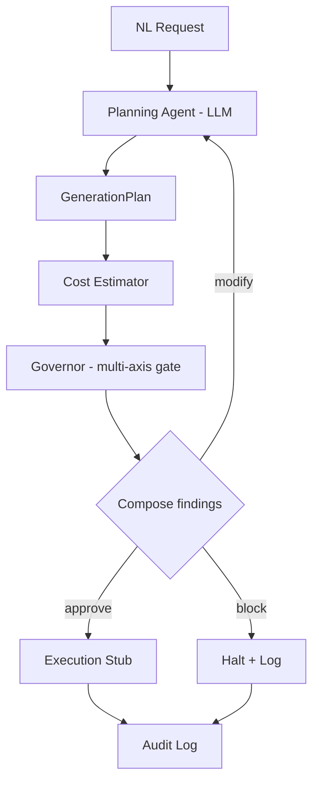

# FinOps Governor for Synthetic Data Pipelines

## What this is

A **pre-flight gate for training-value-per-GPU-dollar** in synthetic-data generation.
Before a single frame renders, it refuses jobs that are **over budget**, **geometrically
invalid**, or **predictably low training-value** - and tells you, in dollars, how much of
a job's spend would be wasted.

> _"scene 'floor': 50,000 variations across ~16 declared configurations (~3,125x
> oversampled, ~100% redundant); est. $373.18 of spend adds little training value."_

The three checks are one idea: each is a reason **not to spend GPU-hours on this job,
catchable before you spend**. An LLM proposes plans; a deterministic gate decides. The
headline axis - diversity/redundancy gating - catches the expensive failure no standard
tool catches pre-execution: spending on data that is affordable and renderable but teaches
the model almost nothing.

## How it works



The **Governor** runs independent validity checks - cost, diversity, and (soon) USD
geometry - over the plan, aggregates their findings, and composes one approve / modify /
block decision. Checks reason over the plan and scene description, never over generated
data, which preserves the "block before GPU spend" guarantee.

## Scope

**In scope:** NL -> structured plan; pre-execution cost estimate; deterministic gate that
composes budget, diversity, and geometric-validity axes; execution stub; audit trail.

**Out of scope:** running large-scale generation (execution is stubbed - the *governance*
is the product); GPU autoscaling; downstream model training; validating rendered output
images.

## Status

- **M1** (`v0.1-schema`): the `GenerationPlan` contract + randomization block.
- **M2** (`v0.2-deterministic-gate`): deterministic cost estimator + budget gate.
- **M3** (`v0.3-validity-gate`): the multi-axis Governor - checks composed into one decision.
- **M4** (`v0.4-diversity-gate`): **the diversity/redundancy gate** - a pre-execution
  estimate of wasted, low-training-value spend, quantified in dollars.
- **Next: M5 - the OpenUSD geometric-validity gate** (one more axis on the same seam).

See [ROADMAP.md](./ROADMAP.md) for the full plan, [docs/](./docs/) for design specs, and
[docs/adr/](./docs/adr/) for architecture decisions.

## Quickstart

```bash
python3.12 -m venv .venv && source .venv/bin/activate
pip install -e ".[dev]"
pytest
```
